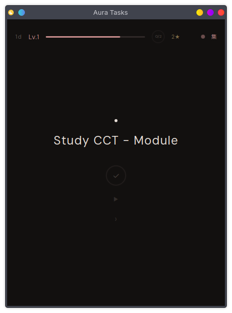

# Aura Tasks

A gamified to-do widget for KDE Plasma 6. Earn XP, level up, maintain streaks, unlock badges, and stay focused with a built-in Pomodoro timer — all from your desktop panel.

## Features

- **Gamification** — Earn XP for completing tasks (10–100 XP based on priority). Level up from Novice to Singularity across 10 ranks. Maintain daily streaks and unlock 8 badges.
- **Pomodoro Timer** — Built-in 25/5/15 timer with 4-session cycles, available per-task or in Focus Shield mode. Desktop notifications on phase transitions.
- **Focus Shield** — Single-task zen mode with breathing pulse animation, skip/next controls, and distraction-free UI.
- **Natural Language Input** — Type `Buy groceries #shopping !high tomorrow` to auto-extract tags, priority, and due dates.
- **7 Themes** — Sumi (ink), Kon (indigo), Matsu (pine), Sakura (cherry), Ishi (stone), Washi (paper/light), and System (adapts to your Plasma theme).
- **Recurring Tasks** — Set tasks to repeat daily or weekly.
- **Undo Completion** — Accidentally checked off a task? Undo it from the Done tab.

## Screenshots

### Sumi (default dark)


### Focus Shield
Single-task zen mode with breathing pulse, pomodoro timer, and skip controls.



## Themes

Cycle through themes by clicking the colored dot in the header. All 7 themes use consistent color tokens across every UI element.

| Theme | Style | Preview |
|-------|-------|---------|
| **Sumi** 墨 | Japanese ink (default) |  |
| **Kon** 紺 | Deep indigo |  |
| **Sakura** 桜 | Cherry blossom |  |
| **Ishi** 石 | Stone / granite |  |
| **Washi** 和紙 | Paper (light mode) |  |
| **Matsu** 松 | Pine / forest | *coming soon* |
| **System** | Adapts to your Plasma theme | *varies* |

## Install

### From KDE Store

Search for "Aura Tasks" in **Add Widgets → Get New Widgets → Download**.

### Manual Install

```bash
git clone https://github.com/ghostface-bz/aura-tasks.git
cd aura-tasks
kpackagetool6 -t Plasma/Applet -i plasmoid/
```

To update:
```bash
git pull
kpackagetool6 -t Plasma/Applet -u plasmoid/
```

To uninstall:
```bash
kpackagetool6 -t Plasma/Applet -r org.kde.auratasks
```

### Package as .plasmoid

```bash
cd plasmoid && zip -r ../aura-tasks.plasmoid . && cd ..
```

Then install the `.plasmoid` file via Plasma's widget installer or:
```bash
kpackagetool6 -t Plasma/Applet -i aura-tasks.plasmoid
```

## Requirements

- KDE Plasma 6.0+
- Qt 6
- `notify-send` (for desktop notifications, usually pre-installed)

Works on any Linux distribution running KDE Plasma 6: Fedora, Arch, Ubuntu/Kubuntu, openSUSE, Debian, etc.

## Input Syntax

| Syntax | Example | Effect |
|--------|---------|--------|
| `#tag` | `Fix bug #work #urgent` | Adds tags |
| `!low` `!high` `!urgent` | `Clean desk !low` | Sets priority (1/3/4) |
| `tomorrow` | `Call dentist tomorrow` | Due tomorrow |
| `today` | `Submit report today` | Due today |
| `next week` | `Review PR next week` | Due in 7 days |
| `daily` / `weekly` | `Standup daily` | Recurring task |

## XP & Levels

| Priority | XP | Level | Threshold | Name |
|----------|-----|-------|-----------|------|
| Low | 10 | 1 | 0 | Novice |
| Normal | 25 | 2 | 100 | Apprentice |
| High | 50 | 3 | 300 | Adept |
| Urgent | 100 | 4 | 600 | Expert |
| | | 5 | 1,000 | Master |
| | | 6 | 1,500 | Grandmaster |
| | | 7 | 2,100 | Astral |
| | | 8 | 2,800 | Nebula |
| | | 9 | 3,600 | Cosmic |
| | | 10 | 4,500 | Singularity |

## Badges

| Badge | Condition |
|-------|-----------|
| First Task | Complete 1 task |
| 10 Tasks | Complete 10 tasks |
| Centurion | Complete 100 tasks |
| 3-Day Streak | 3 consecutive days |
| 7-Day Streak | 7 consecutive days |
| 30-Day Streak | 30 consecutive days |
| Night Owl | Complete a task after 10 PM |
| Early Bird | Complete a task before 7 AM |

## License

GPL-2.0-or-later

Font: [DM Sans](https://fonts.google.com/specimen/DM+Sans) — SIL Open Font License 1.1
